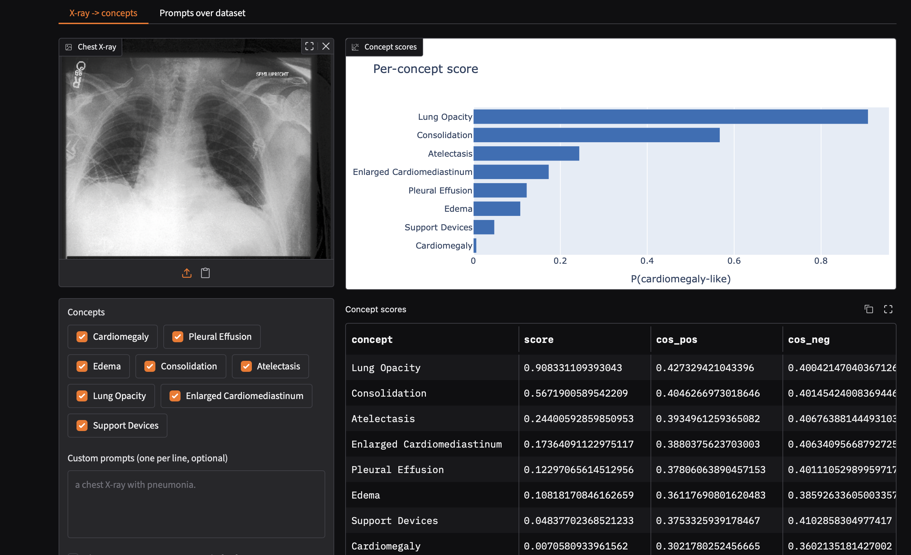

# CLIP Zero-Shot Concept Extraction on Chest X-rays

[](https://kedro.org)

Zero-shot extraction of clinical concepts from chest X-rays using
**BiomedCLIP**, evaluated against expert-verified CheXpert labels. No training
or fine-tuning: concepts are defined by natural-language prompts, scored by
cosine similarity between image and text embeddings.

## What it does

1. Embeds chest X-rays with a medical vision-language model.
2. Builds positive/negative prompt pairs per clinical concept (e.g.
   `"a chest X-ray with cardiomegaly."` vs `"a chest X-ray with no cardiomegaly."`).
3. Scores each image x concept with `softmax([sim_pos, sim_neg] * logit_scale)`.
4. Evaluates per-concept AUROC against CheXpert labels, plus subgroup and
   prompt-sensitivity analysis.

> Research/educational use only. Scores are model similarities, not diagnoses,
> and are not calibrated probabilities.

## Data

Expects **CheXpert-v1.0-small** under `data/01_raw/chexpert/`:

```
data/01_raw/chexpert/
├── train.csv
├── valid.csv          # 234 expert-annotated images (clean ground truth)
├── train/
└── valid/
```

The public Kaggle mirror (`ashery/chexpert`) can be fetched with:

```bash
kaggle datasets download -d ashery/chexpert -p data/01_raw/chexpert --unzip
```

## Setup

```bash
uv venv .venv --python 3.13
uv pip install -e ".[dev,app]"   # dev = pytest/ruff, app = gradio
source .venv/bin/activate
```

## Notebook

`notebooks/01_zero_shot_concept_extraction.ipynb` runs the full pipeline
(preprocessing -> prompts -> embeddings -> scores -> AUROC -> subgroup /
prompt-sensitivity analysis).

```bash
python -m ipykernel install --user --name clip-xray --display-name "Python (clip-xray)"
jupyter lab notebooks/01_zero_shot_concept_extraction.ipynb
```

## Dashboard

Interactive Gradio app to explore the model on uploaded images or the dataset.

```bash
python dashboard/app.py        # http://127.0.0.1:7860
```



- **X-ray -> concepts** — upload a chest X-ray, pick concepts, add custom
  prompts, and see per-concept scores (with a raw-cosine vs softmax toggle).
  "Load random valid image" shows predictions next to ground truth.
- **Prompts over dataset** — score free-form prompts across random CheXpert
  valid images, with mean score, distribution, and AUROC where a prompt maps to
  a known concept.

## Tests and linting

```bash
pytest        # tests/test_zeroshot.py (no model download needed)
ruff check .  # lint
```

## Project layout

```
src/clip_zero_shot_xray/
├── zeroshot/           # shared zero-shot core
│   ├── model.py        # BiomedCLIP loading + image/text embeddings
│   ├── prompts.py      # concept vocabulary + prompt templates
│   ├── scoring.py      # pos/neg scores, prompt ranking, AUROC
│   └── data.py         # CheXpert path remapping, labels, sampling
├── pipelines/          # Kedro pipelines
└── ...
dashboard/app.py       # Gradio dashboard
notebooks/             # analysis notebooks
```

## Kedro

This project is scaffolded with Kedro. Run pipelines with `kedro run` and view
docs via [kedro.org](https://docs.kedro.org).
